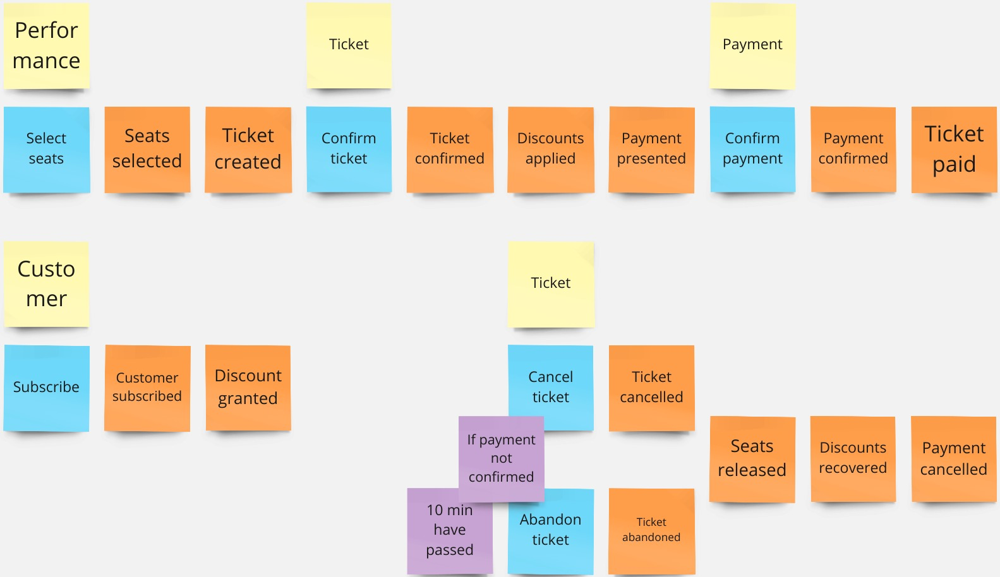

# Event-Driven Architectures: from notifications to Event Sourcing

## Theatre tickets application

This is an example application in the domain of theatre tickets implemented following an event-driven architecture.

This is the tactical event-based model:

## Contents

* Notification example: discount granted use case.  
  See class and related test: `com.github.davgarcia.theatre.tickets.DiscountService` in module `theatre-tickets-notification`.

* ECST example: select seats for a performance.  
  See class and related test: `com.github.davgarcia.theatre.tickets.command.PerformanceCommandService` in module `theatre-tickets-ecst`.

* Event Sourcing + CQRS: full implementation of all theatre tickets domain logic.  
  See module `theatre-tickets-es` and test class `com.github.davgarcia.theatre.tickets.TheatreTicketsTest`.

## Event Sourcing

### Highlights

Commands and queries are directly invoked from the tests. There is no HTTP REST adapter.

All other adapters are in-memory fakes: event journal, persistence and payment gateway.  
These are implemented in the `theatre-tickets-infra` module.

That same module also contains an in-memory task scheduler to run timeout logic.

Also in the `theatre-tickets-infra` module there two implementations of the `CommandDispatcher` interface:
a single-writer using Java `synchronized` (yes, very elaborate) and another one implementing OCC (Optimistic Concurrency Control),
although it's kind of useless given the event journal is a fake.

Other basic DDD, CQRS and ES interface contracts are also defined in the `theatre-tickets-infra` module:
`AggregateRoot`, `Entity`, `Command` and `Event`.

The Payment aggregate has an example of two possible implementations for the same command:
idempotent payment proposal and payment proposal with rollback.

### Package structure

1. `command`: each aggregate has its own subpackage with commands and entity model, including own consumer 
   and command context (infrastructure objects needed by commands).
2. `event`: each aggregate has its own subpackage containing the events published by it.
   This is the real event-based domain model.
3. `query`: query model example. The use case is aggregating all ticket transactions to build a customer history.
4. `saga`: process sagas to trigger secondary events and carry out compensation actions.
   It contains event consumers and its own persistent entity called `ProcessState`.
